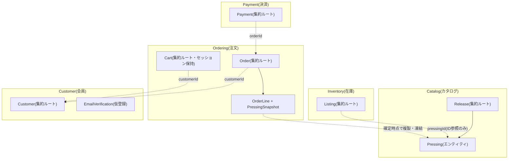

# 00. 全フェーズ共通前提

このファイルは、レコード販売ECサイト(record-shop-ec)を再作成するすべてのフェーズ(phase-1〜phase-7)で
最初に読む共通ルールです。各フェーズのプロンプトは「まず `00-common.md` を読むこと」を前提に書かれています。

---

## 0.1 何を作るのか

アナログレコード(中古盤・新品盤)を販売するECサイトを、**DDD(ドメイン駆動設計)の学習・ポートフォリオ**として
4つのGitリポジトリで構築する。

| リポジトリ | 役割 | 主な技術 |
|---|---|---|
| `record-shop-ec-mybatis` | アプリ本体(ドメイン層・Web層・MyBatis永続化層) | Java 21 / Spring Boot 3.5 / MyBatis / Thymeleaf / Spring Security / PostgreSQL |
| `record-shop-ec-cdk` | AWSインフラ定義(1スタック) | AWS CDK v2 / TypeScript |
| `record-shop-ec-docs` | 設計ドキュメント(ドメイン図・ER図・クラス図・インフラ図・画面仕様・ログインURL) | Markdown + Mermaid |
| `record-shop-ec-tests` | システムテスト仕様書(68ケース)と実施記録 | Markdown |

**4リポジトリは同一の親フォルダ直下に兄弟ディレクトリとして配置すること**(必須)。
`record-shop-ec-cdk` は Docker ビルドコンテキストとして `../record-shop-ec-mybatis` を参照し、
`record-shop-ec-docs` は `../record-shop-ec-mybatis/...` への相対リンクを持つ。

```
<親フォルダ>/
  record-shop-ec-mybatis/
  record-shop-ec-cdk/
  record-shop-ec-docs/
  record-shop-ec-tests/
```

---

## 0.2 実行前に決める値(プレースホルダ)

指示書中の `{...}` は以下の値に読み替える。実行者は着手前に決めておくこと。

| プレースホルダ | 意味 | 例 / 既定 |
|---|---|---|
| `{GITHUB_OWNER}` | GitHubのユーザー名(privateリポジトリを作る先) | `osidasi0005` |
| `{MAIL_FROM_ADDRESS}` | 会員登録の確認コード・登録完了メールの送信元。**AWS SESで送信検証済みである必要がある** | 自分のGmail等 |
| `{AWS_REGION}` | AWSリージョン | `ap-northeast-1` |
| `{AWS_PROFILE}` | AWS CLIのプロファイル名(未指定ならdefault) | `default` |

**プレースホルダにしない固定値**(ダミーなので指示書どおりに使う):

| 項目 | 値 |
|---|---|
| 管理者アカウントのメール | `admin@example.com` |
| ローカル(Docker Compose)の管理者パスワード | `Passw0rd!2024` |
| サンプル顧客4名(`tanaka.hanako@example.com` 等)のパスワード | `Passw0rd!2024`(管理者と統一) |
| DB名 / DBユーザー / DBパスワード(ローカル) | `recordshop_mybatis` / `recordshop` / `recordshop` |

AWS本番環境の管理者パスワードは Secrets Manager で自動生成し、コード・ドキュメントに平文を書かない。

---

## 0.3 開発環境の前提ツール

- Java 21(Eclipse Temurin 推奨)。Maven は `mvnw` を同梱するので別途インストール不要
- Docker Desktop(`docker compose` が使えること)
- Node.js 20以上 + npm(phase-5 のCDK)
- AWS CLI v2(認証済み。`aws sts get-caller-identity` が通ること)(phase-5)
- `gh` CLI(`gh auth status` が通ること)
- git(`user.name` / `user.email` 設定済み)

---

## 0.4 Git / GitHub の運用ルール

- 各リポジトリはデフォルトブランチ `master` で作る: `git init -b master`
- コミットメッセージは**日本語**、1行目に要約(例: `フェーズ1: Catalog/Inventory集約とドメイン単体テストを追加`)
- 各フェーズの完了条件を満たしたらコミットする。フェーズ内でも区切りのよいところで小さくコミットしてよい
- GitHubへの公開はフェーズ末尾の指示に従い、**privateリポジトリ**として作成する:
  ```bash
  gh repo create {GITHUB_OWNER}/<repo-name> --private --source=. --remote=origin --push
  ```
- 個人情報(実メールアドレス・AWSアカウントID・CloudFrontドメイン)はコードに直書きせず、環境変数・プレースホルダ・`cdk deploy` の出力から得る

---

## 0.5 技術スタック(固定)

| 項目 | 値 |
|---|---|
| Java | 21 |
| Spring Boot | 3.5.x(`spring-boot-starter-parent`) |
| MyBatis | `mybatis-spring-boot-starter` 3.0.x |
| DB(本番・ローカル) | PostgreSQL 16 |
| DB(自動テスト) | H2(`MODE=PostgreSQL` インメモリ) |
| テンプレート | Thymeleaf + `thymeleaf-extras-springsecurity6` |
| 認証 | Spring Security フォームログイン + BCrypt |
| ヘルスチェック | Spring Boot Actuator(`/actuator/health` のみ公開) |
| メール送信 | AWS SDK for Java v2 `ses` |
| ビルド | Maven Wrapper(3.9.x) |
| コンテナ | `eclipse-temurin:21-jdk-alpine`(build) / `eclipse-temurin:21-jre-alpine`(runtime) |
| インフラ | AWS CDK v2(TypeScript、`aws-cdk-lib` 2.2xx、`tsx` で実行、`@swc/jest` でテスト) |

Maven座標: groupId `com.example.recordshop` / artifactId `record-shop-ec-mybatis` / version `0.1.0`。

---

## 0.6 コード規約(Java)

### パッケージ構成
```
com.example.recordshop
  RecordShopMybatisApplication          @SpringBootApplication + @MapperScan("com.example.recordshop.infrastructure.mybatis")
  config/                               Spring設定(SecurityConfig, WebConfig, MailConfig, DomainServiceConfig)
  domain/
    shared/                             Money, Address, CountryCodes, Identifiers, 例外3種, event/DomainEvent
    catalog/  inventory/  ordering/  payment/  customer/     各Bounded Context(集約・VO・Enum・リポジトリIF・ドメインサービス・event/)
  infrastructure/
    mybatis/                            Mapper IF・Row record・MyBatisXxxRepository・UuidTypeHandler
    memory/                             InMemoryXxxRepository(テスト用フェイク、Springアノテーション無し)
    security/                           BCryptPasswordHasher, CustomerUserDetails(+Service), AdminAccountSeeder
    mail/                               SesEmailSender
    web/                                CloudFrontProtoFilter, NoIndexHeaderFilter
    devdata/                            SampleDataSeeder
  web/
    ApiExceptionHandler, ErrorResponse, PathIds
    catalog/  inventory/  ordering/  payment/  customer/  admin/    Controller・Request/Response DTO・Form
```

### ドメイン層のルール
- `domain/**` は **Spring・MyBatis・JDBCに一切依存しない素のJava**(`org.springframework` の import 禁止)。Bean登録は `config/DomainServiceConfig` の `@Bean` で行う
- 集約ルート・エンティティは `public final class`、値オブジェクトは `record`
- **ID値オブジェクト**: `public record XxxId(UUID value)` で、`static XxxId generate()`(`UUID.randomUUID()`)、`static XxxId of(String)`(`Identifiers.parse(uuid, "XxxId")`)、`toString()` は `value.toString()`。null禁止
- **不変条件はメソッド内でガード**し、違反時は `InvariantViolationException`(RuntimeException)を投げる。メッセージは日本語で具体的に(例: `在庫不足です: 要求=%d, 在庫=%d`)
- **状態遷移**は Enum に `static final Map<Status, Set<Status>> ALLOWED_TRANSITIONS = new EnumMap<>(...)` の許可遷移テーブルを持たせ、`canTransitionTo(next)` / `isTerminal()` を提供する。不許可の遷移は `IllegalStateTransitionException` を投げる(メッセージ例: `Listing のステータスを %s から %s へ変更することはできません`)
- **pendingEvents パターン**: `Listing` / `Order` / `Payment` は `List<DomainEvent> pendingEvents` を持ち、状態変更時にイベント(record、`Instant occurredAt()` を持つ)を積む。`List<DomainEvent> pullEvents()` で `List.copyOf` を返してから `clear()`
- 永続化からの復元用に `static reconstitute(...)` ファクトリを持つ(検証を通さず全フィールドを受け取る)
- 例外3種(`domain/shared`):
  - `InvariantViolationException extends RuntimeException` — 不変条件違反
  - `IllegalStateTransitionException extends RuntimeException` — 不許可の状態遷移
  - `MalformedIdentifierException extends IllegalArgumentException` — ID文字列の形式不正(IAEを継承するのは既存の `catch (IllegalArgumentException)` に漏らさないため)
- ドメインサービスは `public final class`、コンストラクタでリポジトリIFを受け取る

### テストのルール
- テストメソッド名は日本語で「何を保証するか」を書く(例: `used_数量2で予約しようとすると拒否される`)。JUnit 5 + AssertJ
- ドメイン層のテストは `@SpringBootTest` を使わず、`InMemoryXxxRepository` を手動 `new` して使う
- 永続化層のテストは `@SpringBootTest @Transactional`(H2)、楽観ロック競合テストのみ `@Transactional` なし
- 画面は `PageRenderingTest`(`@SpringBootTest @AutoConfigureMockMvc`)で実際にレンダリングして検証する

---

## 0.7 用語集(ユビキタス言語)

| 用語 | 意味 |
|---|---|
| **Release**(作品) | アルバム等の作品そのもの(タイトル・アーティスト・ジャンル・初出年)。Catalog集約ルート |
| **Pressing**(プレス版) | 同じ作品の物理的な版(レーベル・品番・製造国・製造年・フォーマット)。Release配下の子エンティティ。同一Release内で「品番+製造国+製造年」で一意 |
| **Listing**(出品) | 特定Pressingの販売単位。NEW(在庫数を持つ)か USED(1点物、Goldmineグレード付き)。Inventory集約ルート |
| **Goldmineグレード** | 中古レコードの標準的な状態評価。MINT / NEAR_MINT / VERY_GOOD_PLUS / VERY_GOOD / VERY_GOOD_MINUS / GOOD_PLUS / GOOD / FAIR / POOR の9段階。盤(Vinyl)とジャケット(Sleeve)を独立に評価 |
| **Cart** | 会員のカート。HttpSessionのみに保持しDB永続化しない |
| **Order** / **OrderLine** | 注文と明細。明細は確定時点の **PressingSnapshot**(カタログ情報の凍結コピー)を持ち、後からカタログが変わっても追従しない |
| **Payment** | 決済。決済ゲートウェイ連携は行わず、Captureは常に即時成功する擬似実装 |
| **Customer** | 会員。ロールは CUSTOMER / ADMIN。ADMINは自己登録できず起動時Seederのみが作る |
| **EmailVerification** | 会員登録の仮登録(6桁確認コード、有効期限10分、試行上限5回) |
| **Bounded Context** | Catalog / Inventory / Ordering / Payment / Customer の5つ。コンテキストをまたぐ参照は常にIDのみ(DB上もFK制約なし) |

---

## 0.8 全体アーキテクチャ(俯瞰)



ドメインサービスによる調停:
- `OrderPlacementService`(Ordering): Cart → 各Listingを `reserve()` → Release/Pressingから `PressingSnapshot` 生成 → `Order` 生成。途中失敗時は予約済みListingを `cancelReservation()` で補償ロールバック
- `PaymentCaptureService`(Payment): Orderの合計金額で `Payment` を起票し即Capture、Orderを `markPaid()`
- `CustomerRegistrationService` / `EmailVerificationService`(Customer): Email一意性チェック・パスワードハッシュ化・2フェーズ登録

**Ordering/Payment → Inventory への通知**(本指示書で修正済みとして仕様化する点):
- 決済確定後は各OrderLineのListingへ `confirmSale(quantity)` を呼び、USED出品を SOLD にする
- 注文キャンセル時は各OrderLineのListingへ `cancelReservation(quantity)` を呼び、在庫を戻す

---

## 0.9 フェーズ一覧

| フェーズ | 対象リポジトリ | 成果 |
|---|---|---|
| phase-1 | record-shop-ec-mybatis | プロジェクト骨格 + ドメイン層(5コンテキスト + shared)+ InMemoryリポジトリ + ドメイン単体テスト |
| phase-2 | record-shop-ec-mybatis | schema.sql + MyBatis永続化層 + application.yml + H2結合テスト + 楽観ロック競合テスト |
| phase-3 | record-shop-ec-mybatis | REST API + Thymeleaf画面 + Spring Security + フィルタ + CheckoutService + SESアダプタ + PageRenderingTest |
| phase-4 | record-shop-ec-mybatis | SampleDataSeeder + アートワークSVG + robots/noindex + Dockerfile/compose + README + GitHub push |
| phase-5 | record-shop-ec-cdk | CDKスタック + テスト + デプロイ/destroy手順 + GitHub push |
| phase-6 | record-shop-ec-docs | 設計ドキュメント7本 + Mermaid図 + スクリーンショット + GitHub push |
| phase-7 | record-shop-ec-tests | システムテスト仕様書(68ケース)+ 実施記録テンプレート + GitHub push |
