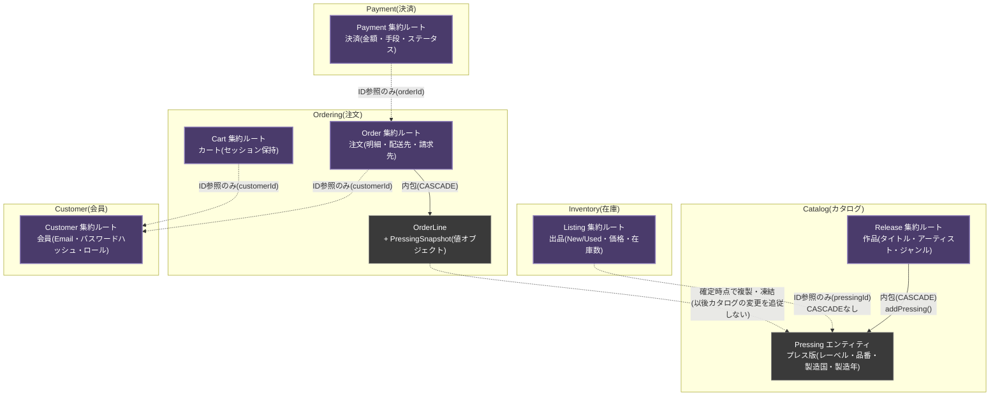
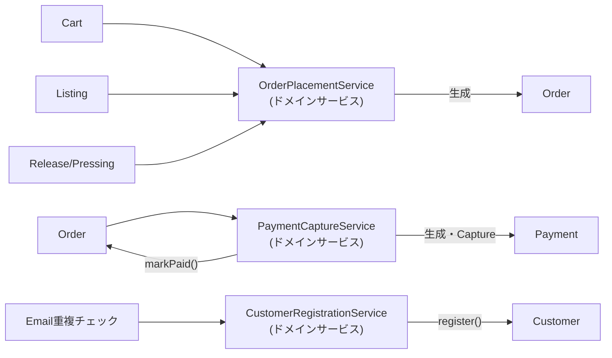

# ドメイン図

レコード販売ECサイトのドメインモデルを、境界づけられたコンテキスト(Bounded Context)ごとに示す。
各コンテキストは独立した集約(Aggregate)を持ち、コンテキストをまたぐ参照は**IDのみの参照**とし、
CASCADE(親子関係の連鎖操作)はコンテキスト内で完結させる。

> このドメイン層(`domain/**`)はDB・フレームワークに一切依存しない素のJavaで実装されている。
> `Release`/`Pressing`はジャケット画像URL(`artworkUrl`)も保持し、`Release.changeArtworkUrl()`
> `Release.changePressingArtworkUrl()`で登録後の設定・変更もできる。

## コンテキスト全体図

実線矢印(→)は同一集約内の親子関係(CASCADE)、破線矢印(-.→)はコンテキストをまたぐID参照
(データベース上もFK制約を持たない、アプリケーションレベルの参照)を表す。

## ドメインサービスによる集約間の調停

単一の集約では守れない、複数集約にまたがる不変条件はドメインサービスが調停する。

- **OrderPlacementService**: カートの中身をもとに各Listingを`reserve()`(在庫予約)し、
  Release/Pressingから`PressingSnapshot`を作って`Order`を生成する。途中で例外が起きた場合は
  それまでに予約したListingを`cancelReservation()`でロールバックする(補償トランザクション)。
- **PaymentCaptureService**: `Order`の合計金額と一致する`Payment`を起票して即時Captureし、
  `Order`を`PAID`にする。
- **CustomerRegistrationService**: Email一意性チェック(Customer集約単体では強制できない、
  リポジトリ経由の重複チェックが必要)とパスワードハッシュ化を行い`Customer`を登録する。

## 設計判断の要点

- **Listing.pressingId はただのUUID参照**: Listing(Inventory)とPressing(Catalog)は別集約であり、
  在庫の増減がカタログ側の変更を引き起こしてはならないため、CASCADEもJOINも行わない
- **OrderLine.pressingSnapshot は確定時点の複製**: 後日カタログ情報が訂正されても、既存の注文内容は
  発注当時のまま変わらない(値オブジェクトなので生成後は不変)
- **Customer.role による簡易実装**: 出品者(Seller)を独立した集約にはせず、Customerに
  ADMINロールを持たせることで管理画面アクセスを表現する簡易実装(本格運用ならSeller/Staffを
  別集約に分離すべき箇所として、あえて残している)
