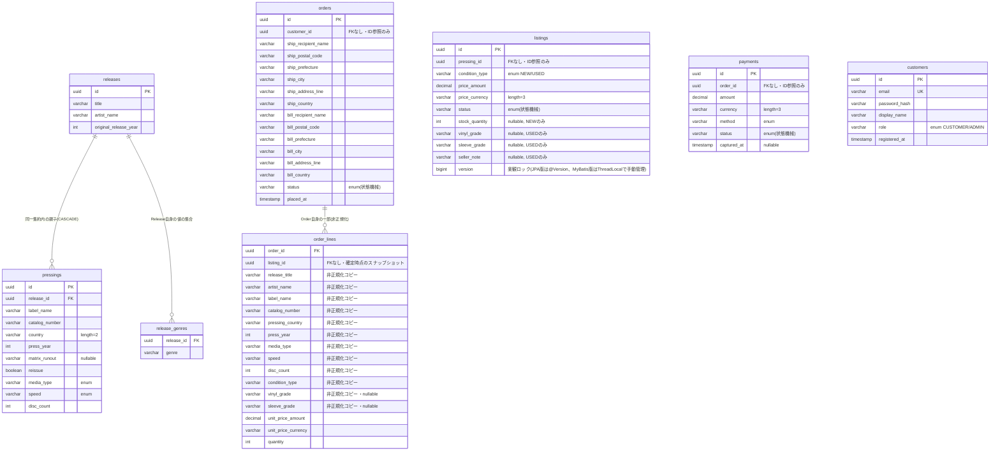

# ER図

実際にRDS(PostgreSQL)上に作られるテーブル構造。ドメイン集約の境界に合わせて、**集約をまたぐ
外部キー(FK)制約は意図的に張っていない**(アプリケーションレベルでのID参照のみ)。

この物理構造は`record-shop-ec-jpa`(JPA版)・`record-shop-ec-mybatis`(MyBatis版)の
**どちらも同一**。ただし到達方法が異なる:

- **JPA版**: JPAエンティティ(`infrastructure/jpa/**`)のアノテーション(`@OneToMany`、
  `@ElementCollection`等)からHibernateが実行時にSQLを自動生成する
- **MyBatis版**: `schema.sql`に明示的なDDLを書き、`infrastructure/mybatis/**`の
  Mapper(XML+Java)で手動SQLを書く。同じテーブル構造になるよう`schema.sql`を設計している

## テーブル一覧

## 設計判断の要点

| テーブル間の関係 | JPA版の実装 | MyBatis版の実装 | 理由 |
|---|---|---|---|
| `releases` → `pressings` | `@OneToMany(cascade=ALL, orphanRemoval=true)` | `save()`内でSELECT有無判定→UPDATE時は全delete→re-insert | 同一集約内の親子。Releaseを消せばPressingも消える |
| `releases` → `release_genres` | `@ElementCollection` | 同上(genresも全delete→re-insert) | ジャンルはRelease自身の値の集合であり独立エンティティではない |
| `orders` → `order_lines` | `@ElementCollection`(JOIN FETCHで1回で読み切るためEAGER) | 新規作成時のみinsert(order_linesは確定後不変のため更新パスなし) | OrderLineはOrder自身の一部 |
| `listings.pressing_id` | ただのUUIDカラム | ただのUUIDカラム | Listing(Inventory)とPressing(Catalog)は別集約。CASCADE/JOINなし |
| `orders.customer_id` | ただのUUIDカラム | ただのUUIDカラム | Order(Ordering)とCustomer(Customer)は別集約 |
| `payments.order_id` | ただのUUIDカラム | ただのUUIDカラム | Payment(Payment)とOrder(Ordering)は別集約 |
| `order_lines`の各列 | Pressing情報を列展開して非正規化 | 同左 | `PressingSnapshot`(値オブジェクト)を確定時点で複製・凍結。以後releases/pressingsが変更されても追従しない |

- **`listings.version`(楽観ロック)**: 在庫予約(`reserve()`)は「読み込み→判定→更新」の典型的な
  check-then-actであり、複数リクエストが同じListing(特にUsedの1点物)を同時に注文確定しようと
  すると、DBレベルの排他制御なしには二重販売が起こる。
  - **JPA版**: Hibernateが`@Version`から`UPDATE ... WHERE id=? AND version=?`を自動生成し、
    0件更新(=先に他トランザクションが更新済み)なら`ObjectOptimisticLockingFailureException`
    (Hibernate固有)を投げる
  - **MyBatis版**: dirty checkingが無いため、`MyBatisListingRepository`が`ThreadLocal`で
    「読み込んだ時点のversion」を手動で覚えておき、同じ`UPDATE ... WHERE id=? AND version=?`文を
    自前で発行、0件更新ならSpring基底クラスの`OptimisticLockingFailureException`を投げる
    (結果的にJPA固有の例外に依存しない、より汎用的な実装になった)
  - どちらの版も2スレッド・2トランザクションの競合テストと実PostgreSQLでの同時リクエストで、
    二重販売が起きないことを確認済み
- **`pressings`の一意制約**: `UNIQUE(release_id, catalog_number, country, press_year)` ―
  同一作品内で品番・製造国・製造年が重複するプレス版を許さないというドメインの不変条件を
  DB制約としても保証している。
- **Address専用テーブルを作らない**: 配送先・請求先はどちらも `orders` テーブルへの埋め込み列
  (JPA版は`AddressEmbeddable`、MyBatis版はマッパーが直接列展開、いずれも
  `ship_*`/`bill_*`プレフィックスで列名を分離)として表現する。独立集約ではなく
  Order自身が持つ値オブジェクトのため。
