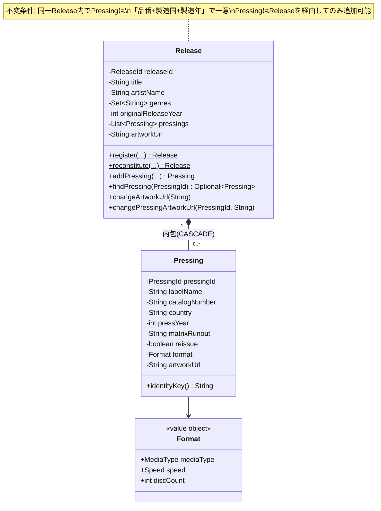
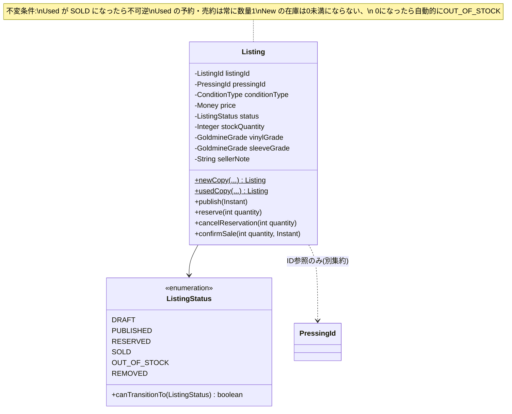
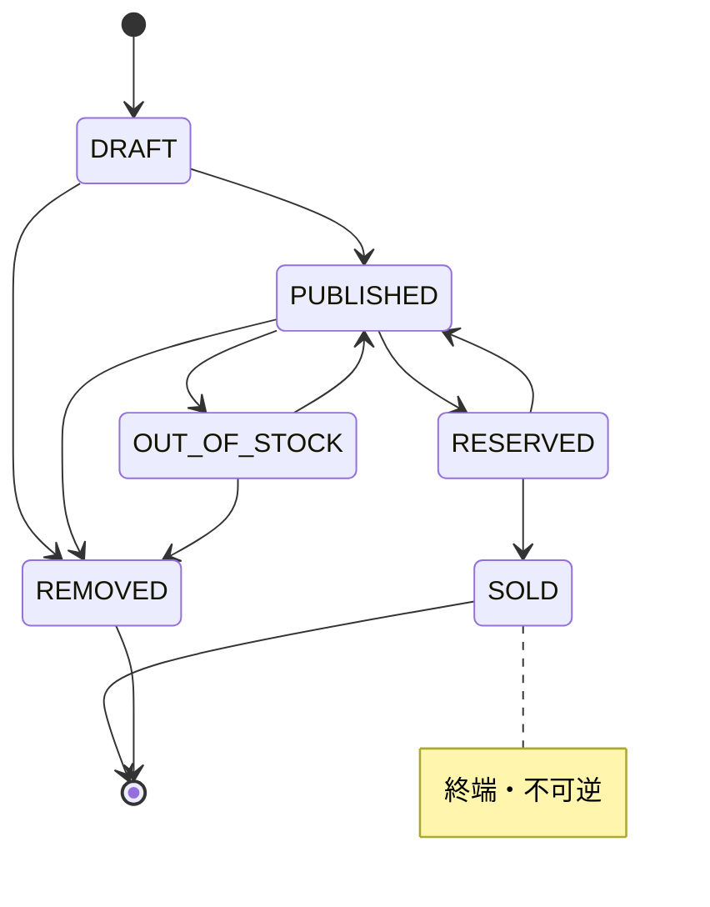
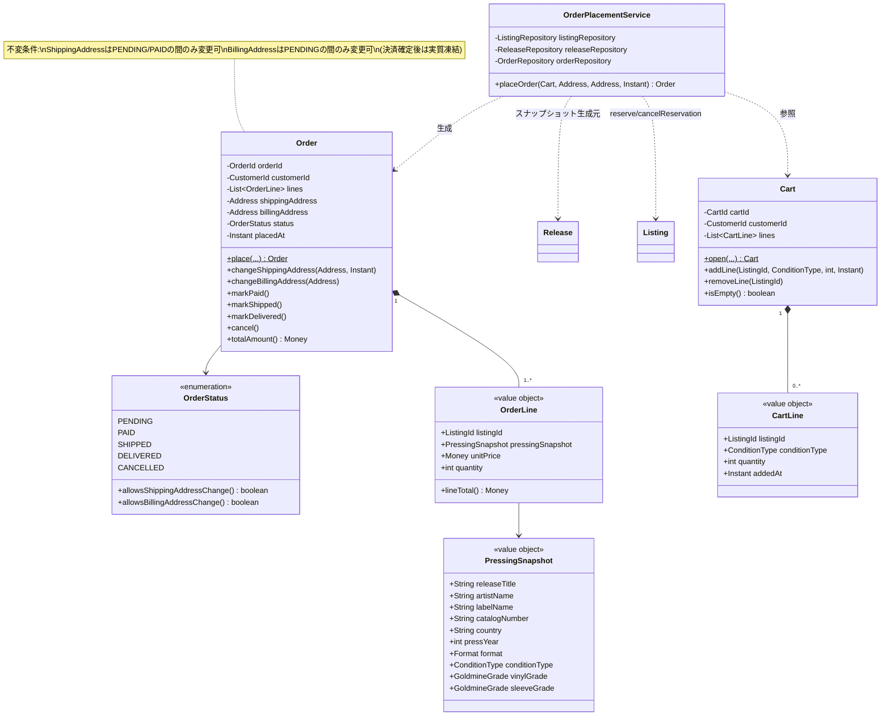
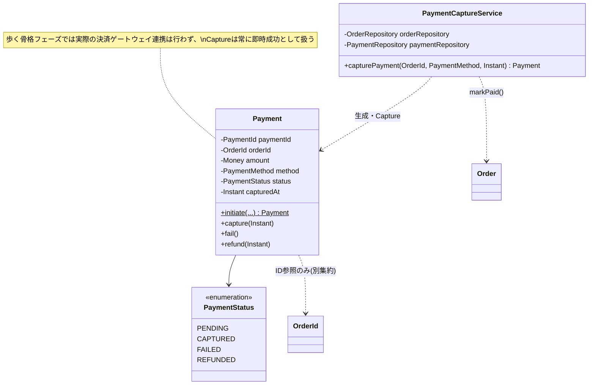
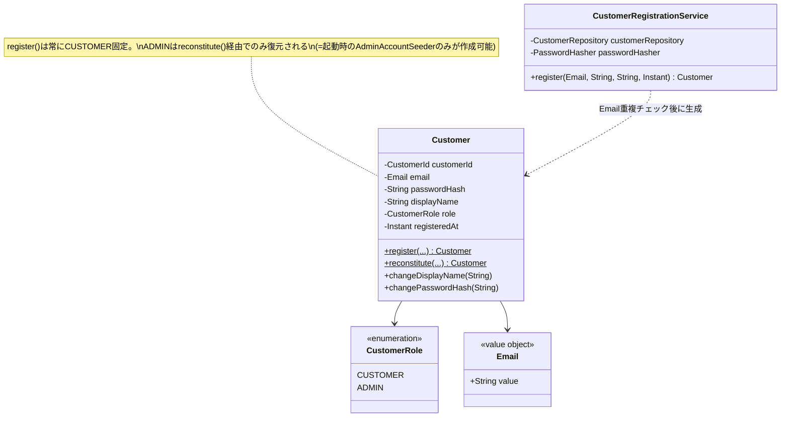
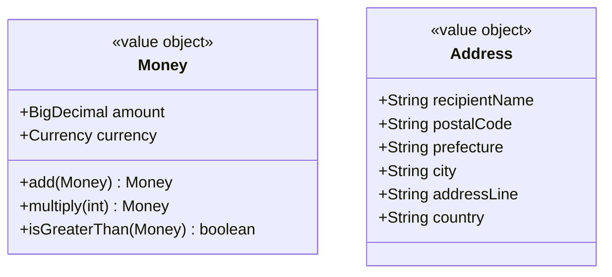

# クラス図

ドメイン層(`domain/**`)の主要クラスを、コンテキストごとに示す。Web層・永続化層(MyBatis)は
含めない(対応関係は [02-er-diagram.md](02-er-diagram.md) を参照)。

## Catalog コンテキスト

## Inventory コンテキスト

## Ordering コンテキスト

## Payment コンテキスト

## Customer コンテキスト

## 共通値オブジェクト(domain/shared)

