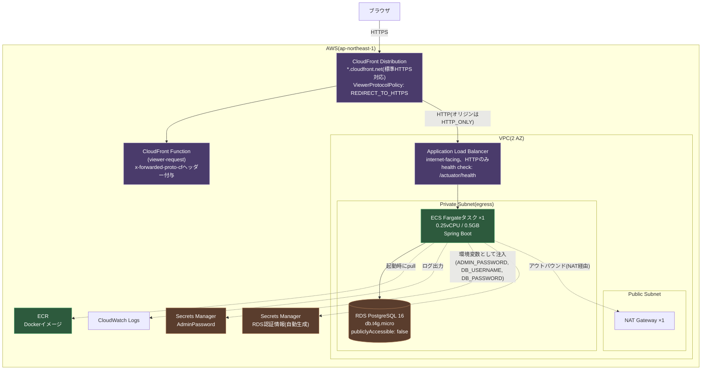
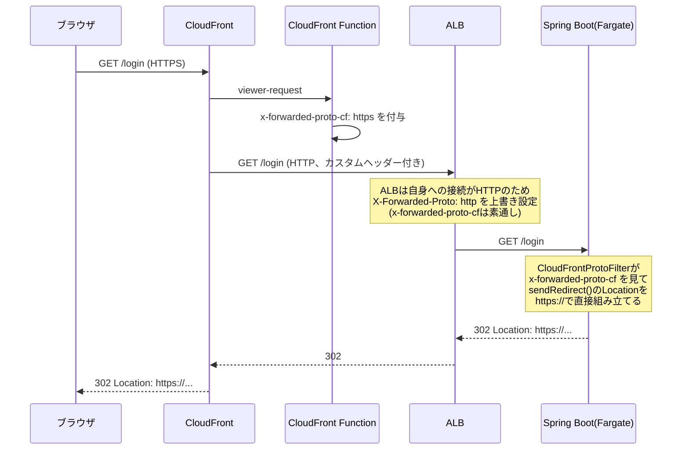

# インフラ構成図

`record-shop-ec-cdk`(AWS CDK、TypeScript)で定義されているAWS構成。`RecordShopEcMybatisCdkStack`
1スタックが、VPC・RDS・ECS Fargate・ALB・CloudFrontを1セット持つ。

## 全体構成



CDK上は`bin/record-shop-ec-cdk.ts`がこのスタックを定義しており、
`npx cdk deploy RecordShopEcMybatisCdkStack` / `npx cdk destroy RecordShopEcMybatisCdkStack`
でデプロイ・削除できる。

## リクエストフロー(HTTPS化の仕組み)

CloudFrontはブラウザとの間をHTTPSにする一方、CloudFront〜ALB間は意図的にHTTPのまま
(独自ドメイン・ACM証明書を用意していないため、ALBにHTTPS証明書を発行できない)。
この構成では **ALBが自分への接続プロトコル(常にHTTP)で`X-Forwarded-Proto`ヘッダーを
毎回上書きしてしまう** ため、標準的な`X-Forwarded-Proto`の転送だけではアプリ側が
「ブラウザは実際にはHTTPSでアクセスしている」ことを認識できない(リダイレクトの
Locationヘッダーが`http://`になってしまう不具合が実際に発生した)。



対応コード:
[`record-shop-ec-mybatis-cdk-stack.ts`](../record-shop-ec-cdk/lib/record-shop-ec-mybatis-cdk-stack.ts)
のCloudFront Function定義、
[`CloudFrontProtoFilter.java`](../record-shop-ec-mybatis/src/main/java/com/example/recordshop/infrastructure/web/CloudFrontProtoFilter.java)
(アプリ側の対応フィルタ)。

## 主要リソースの設定値

| リソース | 設定 | 理由・備考 |
|---|---|---|
| VPC | 2 AZ、NATゲートウェイ1個 | コスト最小化(NATは1個あたり時間課金) |
| RDS | PostgreSQL 16、db.t4g.micro、20GB、`publiclyAccessible: false` | 学習用途で`removalPolicy: DESTROY`(destroy時にDBごと削除) |
| ECS Fargate | 0.25vCPU / 0.5GB、`desiredCount: 1` | コスト最小化。`healthCheckGracePeriod: 300秒`(起動に90秒前後かかるため) |
| ALBヘルスチェック | `/actuator/health`、`healthyThresholdCount: 2` | デフォルトの5だと猶予期間を圧迫しクラッシュループを起こしたため調整 |
| CloudFront | `CachePolicy.CACHING_DISABLED`、`OriginRequestPolicy.ALL_VIEWER` | セッションCookie・CSRFトークンを含む動的画面のためキャッシュ不可 |
| Secrets Manager | RDS認証情報(自動生成)、Adminパスワード(自動生成20文字) | 平文パスワードをコード・環境変数に書かない |

これらの設定値は、クラッシュループ等を実際に起こして試行錯誤の末に調整・確定させたもの。

## コスト構造

NAT Gateway + RDS + ALB + CloudFrontが常時課金対象で、**合計おおよそ月$60〜90程度**
(CloudFrontはデモ規模のアクセス量ならほぼ誤差)。使わなくなったら

```bash
cd record-shop-ec-cdk
npx cdk destroy RecordShopEcMybatisCdkStack
```

で削除する運用としている。
