# 画面仕様書

`record-shop-ec-jpa`の全画面(Thymeleafでレンダリングされるブラウザ向け画面)と、
参考としてREST API(`/api/**`)のURL一覧をまとめる。認証要否は
[`SecurityConfig`](../record-shop-ec-jpa/src/main/java/com/example/recordshop/config/SecurityConfig.java)
の設定に基づく。スクリーンショットは実際にデプロイ済みのCloudFront URLから撮影した
(データはテスト用: `Kind of Blue` / Miles Davis を購入した状態)。

> Web層(`web/**`・`config/**`・テンプレート一式)は`record-shop-ec-mybatis`にも元は無修正で
> コピーされており、URL・入力項目・権限・見た目は**基本的にMyBatis版でも同一**(永続化層
> だけがJPA/MyBatisで異なる)。スクリーンショットはJPA版で撮影したものだが、大半の画面は
> MyBatis版でも同じ見た目になる。
>
> **例外**: ジャケット画像URL(`artworkUrl`)の登録・変更・表示は比較実験の枠を超える
> アプリケーション機能として**MyBatis版にのみ**追加した。JPA版の画面には存在しない
> (対応するスクリーンショットも未取得)。該当箇所は本ドキュメント内で個別に注記する。

## URL一覧(早見表)

| # | URL | メソッド | 画面 | 認証要否 |
|---|---|---|---|---|
| 1 | `/` | GET | トップ(`/catalog`へリダイレクト) | 不要 |
| 2 | `/catalog` | GET | 商品一覧 | 不要 |
| 3 | `/catalog/{releaseId}` | GET | 商品詳細 | 不要 |
| 4 | `/login` | GET/POST | ログイン | 不要 |
| 5 | `/register` | GET/POST | 会員登録 | 不要 |
| 6 | `/cart` | GET | カート表示 | 要ログイン |
| 7 | `/cart/add` | POST | カートに追加 | 要ログイン |
| 8 | `/cart/remove` | POST | カートから削除 | 要ログイン |
| 9 | `/checkout` | GET/POST | チェックアウト | 要ログイン |
| 10 | `/orders` | GET | 注文履歴一覧 | 要ログイン |
| 11 | `/orders/{orderId}` | GET | 注文詳細(所有者チェックあり) | 要ログイン |
| 12 | `/admin/releases` | GET | 管理画面: 作品一覧 | 要ROLE_ADMIN |
| 13 | `/admin/releases/new` | GET | 管理画面: 作品新規登録フォーム | 要ROLE_ADMIN |
| 14 | `/admin/releases` | POST | 作品登録 | 要ROLE_ADMIN |
| 15 | `/admin/releases/{id}` | GET | 管理画面: 作品詳細(プレス版・出品管理) | 要ROLE_ADMIN |
| 16 | `/admin/releases/{id}/pressings` | POST | プレス版追加 | 要ROLE_ADMIN |
| 17 | `/admin/listings` | POST | 出品(Listing)作成 | 要ROLE_ADMIN |
| 18 | `/admin/listings/{id}/publish` | POST | 出品を公開 | 要ROLE_ADMIN |
| 19 | `/admin/releases/{id}/artwork` | POST | 作品全体のジャケット画像URLを設定・変更(MyBatis版のみ) | 要ROLE_ADMIN |
| 20 | `/admin/releases/{id}/pressings/{pressingId}/artwork` | POST | プレス版ごとのジャケット画像URLを設定・変更(MyBatis版のみ) | 要ROLE_ADMIN |

`/error`, `/css/**`, `/js/**`, `/webjars/**`, `/actuator/health` も`permitAll`だが、
エンドユーザー向け画面ではないためここでは割愛する。

## REST API(`/api/**`、参考)

ブラウザ画面とは別に、歩く骨格フェーズから存在する素のREST APIも残っている。
`/api/**`は`SecurityConfig`で認証・CSRFともに除外されており、curl等の外部クライアントから
直接呼び出せる。

| URL | メソッド | 概要 |
|---|---|---|
| `/api/releases` | POST | Release登録(MyBatis版はリクエストボディに`artworkUrl`も含む) |
| `/api/releases/{releaseId}` | GET | Release取得 |
| `/api/releases/{releaseId}/pressings` | POST | Pressing追加(MyBatis版はリクエストボディに`artworkUrl`も含む) |
| `/api/listings` | POST | Listing作成 |
| `/api/listings/{listingId}/publish` | POST | Listing公開 |
| `/api/listings/{listingId}` | GET | Listing取得 |
| `/api/checkout` | POST | 注文確定(カート→Order) |
| `/api/orders/{orderId}` | GET | Order取得 |
| `/api/orders/{orderId}/payments` | POST | 決済Capture |
| `/api/payments/{paymentId}` | GET | Payment取得 |

---

## 公開画面(認証不要)

### 1. トップページ `/`

`/catalog`へ302リダイレクトするだけの入口。

### 2. 商品一覧 `/catalog`

公開済み(`PUBLISHED`)のListingを持つReleaseを一覧表示する。

> **MyBatis版のみ**: 管理画面で設定済みならジャケット画像のサムネイルを表示する。

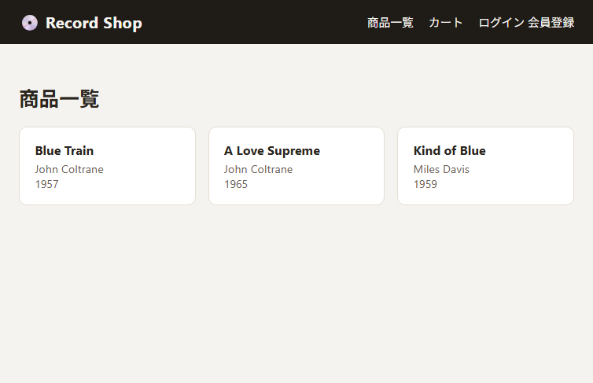

### 3. 商品詳細 `/catalog/{releaseId}`

Releaseに紐づくPressingごとに、公開済みListing(コンディション・価格・在庫)を表示し、
「カートに追加」フォームを持つ。

> **MyBatis版のみ**: 作品全体のジャケット画像(大きいサイズ)と、プレス版ごとに個別設定されて
> いれば版ごとのジャケット画像も表示する。

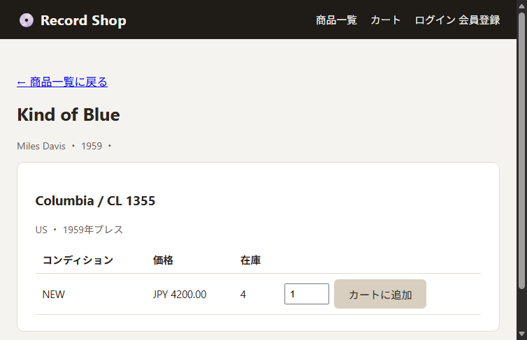

### 4. ログイン `/login`

メールアドレス・パスワードでログインする。ロール(CUSTOMER/ADMIN)による専用ログイン画面の
区別はなく、ログイン後の遷移先は一律`/catalog`で、その後ナビゲーションのリンク表示が
ロールに応じて変わる。

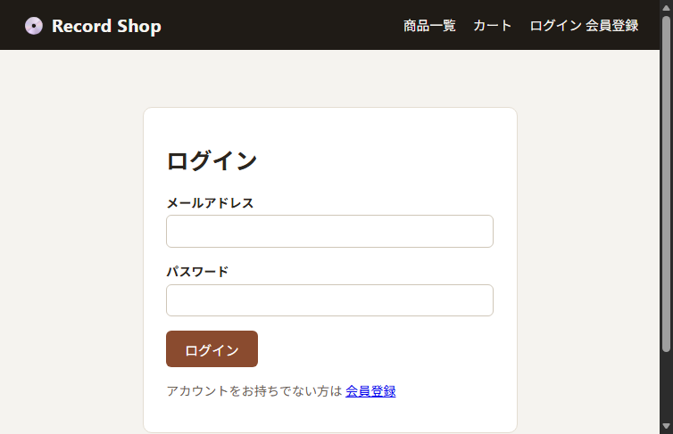

### 5. 会員登録 `/register`

入力項目: メールアドレス(`email`)、パスワード(`password`、8文字以上)、表示名(`displayName`)。
登録すると常にCUSTOMERロールで作成される(ADMINは起動時のシード投入でのみ作成される、
[06-login-urls.md](06-login-urls.md)参照)。

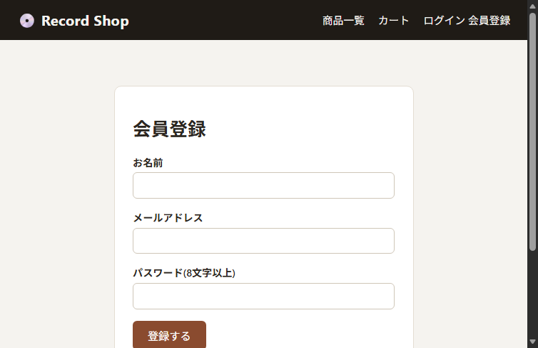

---

## 会員向け画面(要ログイン)

### 6. カート `/cart`

セッション(`HttpSession`)に保持されたカートの中身を表示する。DBには永続化されないため、
サーバー再起動やタスクの入れ替わりでカート内容は失われる(注文自体はDB永続化される)。

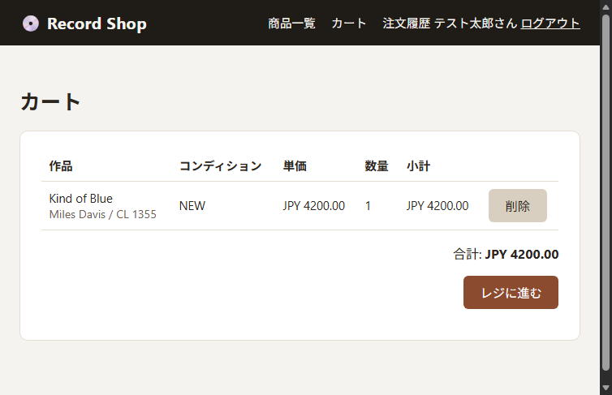

### 7. チェックアウト `/checkout`

入力項目(配送先・請求先を兼用): 宛名(`recipientName`)、郵便番号(`postalCode`)、
都道府県(`prefecture`)、市区町村(`city`)、番地(`addressLine`)、国(`country`)。
送信すると`OrderPlacementService`で在庫予約→Order作成、続けて`PaymentCaptureService`で
即時決済Captureまで行い、成功すれば注文詳細画面へリダイレクトする。楽観ロック競合
(同時購入による在庫奪い合い)が起きた場合はカート画面へエラーメッセージ付きで戻す。

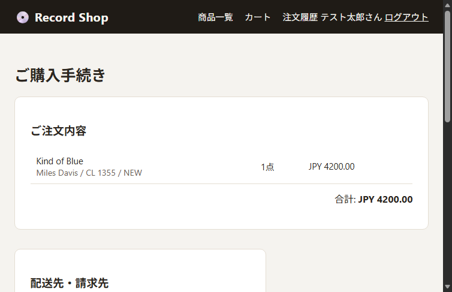

### 8. 注文履歴一覧 `/orders`

ログイン中の会員自身の注文だけを、新しい順に一覧表示する。

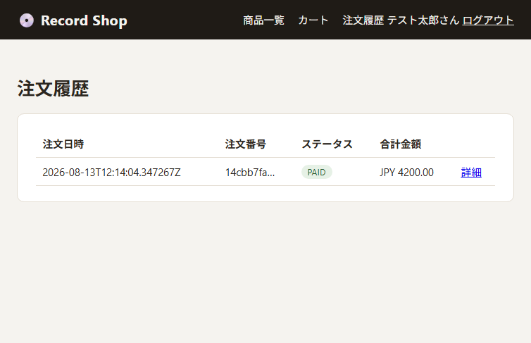

### 9. 注文詳細 `/orders/{orderId}`

注文番号・注文日時・ステータス(PENDING/PAID/SHIPPED/DELIVERED/CANCELLED)・明細
(購入時点のPressing情報を凍結したスナップショット)を表示する。他人の注文IDを直接指定した
場合は404を返す(所有者チェック)。

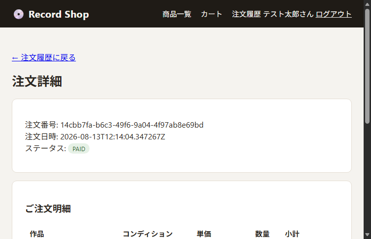

---

## 管理者向け画面(要ROLE_ADMIN)

出品者(管理者)が作品・プレス版・出品を登録するための画面。`/admin/**`は
`SecurityConfig`で`hasRole("ADMIN")`に制限されており、一般会員がアクセスすると403になる。

### 10. 管理画面: 作品一覧 `/admin/releases`

登録済み全Releaseと、紐づくPressing数を一覧表示する。

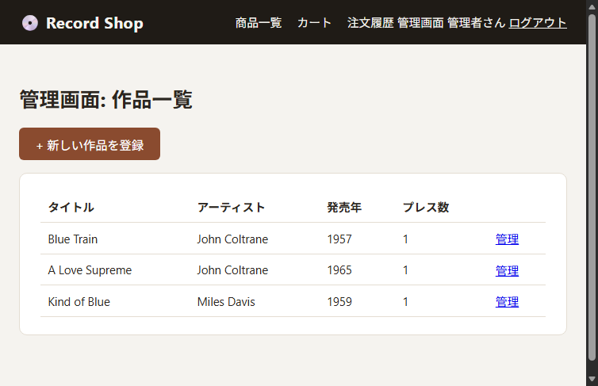

### 11. 管理画面: 作品新規登録 `/admin/releases/new`

入力項目: タイトル(`title`)、アーティスト(`artistName`)、ジャンル(`genres`、カンマ区切り文字列)、
発売年(`originalReleaseYear`)。

> **MyBatis版のみ**: ジャケット画像URL(`artworkUrl`、任意項目)の入力欄がある。

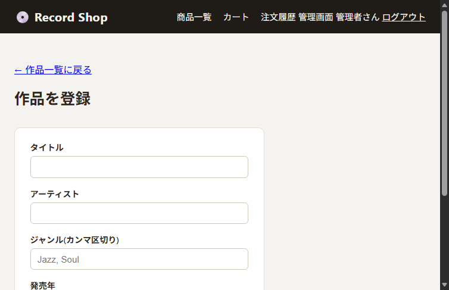

### 12. 管理画面: 作品詳細(プレス版・出品管理) `/admin/releases/{id}`

1画面に3つの機能を集約している:

1. 登録済みPressingごとのListing一覧表示・公開ボタン(`POST /admin/listings/{id}/publish`)
2. Listing新規作成フォーム(`POST /admin/listings`) ―
   入力項目: プレス版(`pressingId`、隠しフィールド)、コンディション(`conditionType`: NEW/USED)、
   価格(`priceAmount`)、在庫数(`initialStock`、NEWのみ)、盤面グレード(`vinylGrade`、USEDのみ)、
   ジャケットグレード(`sleeveGrade`、USEDのみ)、出品メモ(`sellerNote`、USEDのみ)
3. Pressing新規追加フォーム(`POST /admin/releases/{id}/pressings`) ―
   入力項目: レーベル名(`labelName`)、品番(`catalogNumber`)、製造国(`country`)、
   プレス年(`pressYear`)、マトリクス番号(`matrixRunout`、任意)、再発盤か(`reissue`)、
   媒体(`mediaType`)、回転数(`speed`)、枚数(`discCount`)

> **MyBatis版のみ**: 以下のジャケット画像管理機能を追加している。
> 4. 作品全体のジャケット画像URL設定・変更フォーム(`POST /admin/releases/{id}/artwork`)。
>    現在の画像プレビューと入力欄(`artworkUrl`)を持つ
> 5. プレス版ごとのジャケット画像URL設定・変更フォーム(`POST /admin/releases/{id}/pressings/{pressingId}/artwork`、
>    折りたたみ表示)。再発盤ごとにジャケットデザインが異なるケースに対応する
> 6. Pressing新規追加フォーム(上記3)にもジャケット画像URL(`artworkUrl`、任意項目)の入力欄が追加されている

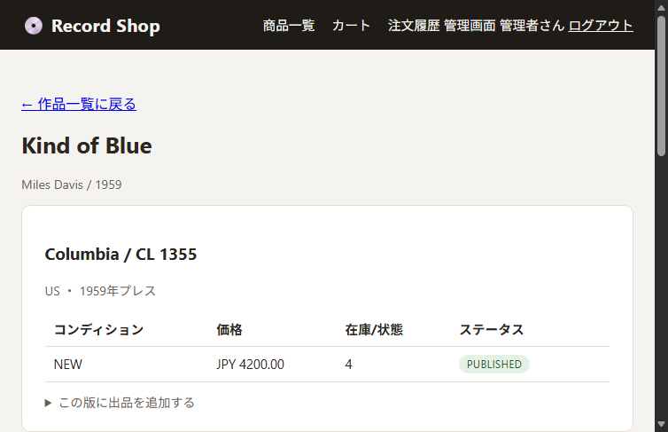

## 権限マトリクス

| 画面区分 | 匿名 | CUSTOMER | ADMIN |
|---|---|---|---|
| 公開画面(`/`, `/catalog/**`, `/login`, `/register`) | ○ | ○ | ○ |
| 会員向け画面(`/cart`, `/checkout`, `/orders/**`) | ✕(`/login`へリダイレクト) | ○ | ○ |
| 管理者向け画面(`/admin/**`) | ✕(`/login`へリダイレクト) | ✕(403) | ○ |

実際にAWS本番環境でこのマトリクスどおりの挙動(一般会員が`/admin/releases`にアクセスすると
403、匿名ユーザーは`/login`へ302)になることを確認済み。
