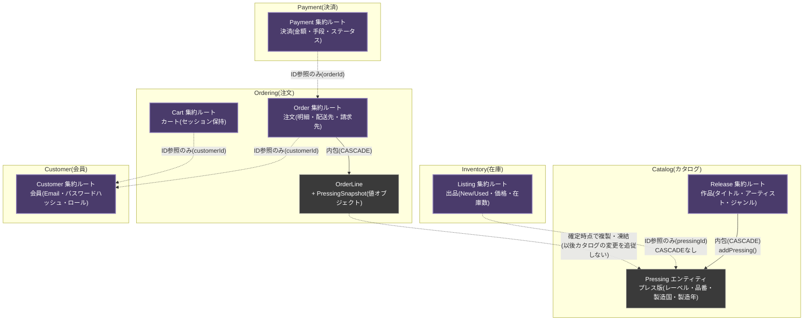
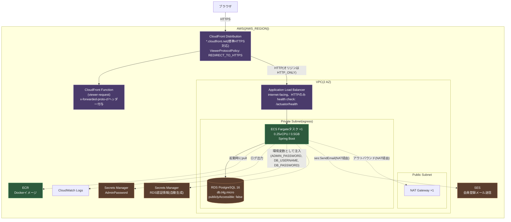

# phase-6: 設計ドキュメント(record-shop-ec-docs)

> このプロンプトを投げる前に、同じフォルダの `00-common.md` を読んで従うこと。
> 作業ディレクトリ: `<親フォルダ>/record-shop-ec-docs`(空フォルダを新規作成して開く。兄弟に `record-shop-ec-mybatis` / `record-shop-ec-cdk` があること)

## 1. このフェーズの目的

実装済みのシステム(phase-1〜5)を、Markdown + Mermaid の**設計ドキュメント7本 + スクリーンショット13枚**にまとめる。
ソースコードを含まないドキュメント専用リポジトリ。実装リポジトリへは兄弟ディレクトリの相対パスでリンクする。

## 2. 前提

- phase-4 完了(ローカルで `docker compose up` できる)。phase-5 のデプロイは任意(スクリーンショットはローカルでもよい)
- 実装コードを読んで書く。指示書と実装が食い違う場合は**実装を正**とし、指示書側の意図(不具合修正済み等)が反映されていなければ実装を直す

## 3. 仕様

### 3.1 リポジトリ構成

```
README.md
01-domain-diagram.md
02-er-diagram.md
03-class-diagram.md
04-infrastructure-diagram.md
05-screen-spec.md
06-login-urls.md
images/02-catalog-list.png … 14-admin-order-detail.png(13枚)
```
`.gitignore` や設定ファイルは無し。

### 3.2 文体・書式規約

- 全編日本語、括弧は全角 `()`、見出しは `#`/`##`/`###`
- **設計判断には必ず「理由」を表または箇条書きで添える**。失敗談(クラッシュループ、`X-Forwarded-Proto` 上書き、Location が `http://` になった、dirty checking 漏れの主キー重複)を隠さず書く
- 図は Mermaid(GitHub でレンダリングされる範囲の記法のみ)。改行は `<br/>`、ジェネリクスは `~T~`、ステレオタイプ `<<value object>>` `<<enumeration>>`、`note for X`
- Mermaid の配色は `classDef` で統一: 集約/エッジ系 `fill:#4a3b6b,stroke:#8b7bb8,color:#fff`、エンティティ `fill:#3a3a3a,stroke:#888,color:#fff`、compute `fill:#2d5a3d,stroke:#5cb87a,color:#fff`、data `fill:#5a3d2d,stroke:#b8845c,color:#fff`
- 実装への相対リンク: `../record-shop-ec-mybatis/src/main/java/...`、`../record-shop-ec-cdk/lib/...`
- 実値(CloudFront ドメイン、AWSアカウントID、実メールアドレス)は書かない。URL は `{ベースURL}` プレースホルダ

### 3.3 `README.md`

- `# レコード販売ECサイト 仕様書` + 前書き2段落(`record-shop-ec-mybatis`(DDD実装、Spring Boot + Thymeleaf + MyBatis)と `record-shop-ec-cdk`(AWS CDK)からなる/会員登録・商品閲覧・カート・チェックアウト・決済・注文履歴・管理画面まで揃ったECサイトとして CloudFront 経由 HTTPS で公開できる、DDD 学習用ポートフォリオ)
- `## 目次` — 01〜06 への番号付きリンク + 一行説明
- `## 関連リポジトリ` — `../record-shop-ec-mybatis`、`../record-shop-ec-cdk`、`../record-shop-ec-tests`
- `## 実装のハイライト` — 3点: 在庫予約の同時実行制御(楽観ロック、2スレッド競合テストで二重販売なし)/ CloudFront 経由の HTTPS 化(独自ドメイン・ACM なしで、CloudFront Function + カスタムヘッダーで X-Forwarded-Proto 上書き問題を回避)/ Bounded Context の厳密な分離(5コンテキストは ID 参照のみ・FK なし、PressingSnapshot 凍結)

### 3.4 `01-domain-diagram.md`

章立て: 前書き(ID参照のみ・CASCADEはコンテキスト内、引用ブロックで「domain/** はフレームワーク非依存」「artworkUrl 変更可」)→ `## コンテキスト全体図` → `## ドメインサービスによる集約間の調停` → `## 設計判断の要点`

コンテキスト全体図(この内容の `graph TB`):

図の下に「実線=同一集約内の親子(CASCADE)、破線=コンテキストをまたぐID参照(DB上もFK制約なし)」。

ドメインサービス図(`graph LR`): `Cart`/`Listing`/`Release/Pressing` → **OrderPlacementService** →「生成」→ `Order`;`Order` → **PaymentCaptureService** →「生成・Capture」→ `Payment`、→「markPaid()」→ `Order`;`Email重複チェック` → **CustomerRegistrationService** →「register()」→ `Customer`。加えて **決済確定 → Listing.confirmSale() / キャンセル → Listing.cancelReservation()** の Ordering→Inventory 通知も図か文章で示す。
各サービスの説明3点(補償トランザクション、Order合計でCapture、Email一意性+ハッシュ化)。

設計判断の要点3点: `Listing.pressingId` はただのUUID参照 / `OrderLine.pressingSnapshot` は確定時点の複製 / `Customer.role` による簡易実装(Seller を別集約にしていない、あえて残す)。

### 3.5 `02-er-diagram.md`

章立て: 前書き(集約をまたぐFKは意図的に張らない、`schema.sql` の明示DDL、Mapper XML の手動SQL)→ `## テーブル一覧`(`erDiagram`)→ `## 設計判断の要点`

`erDiagram`: リレーションは3本のみ(`releases ||--o{ pressings : "同一集約内の親子(CASCADE)"`、`releases ||--o{ release_genres : "Release自身の値の集合"`、`orders ||--o{ order_lines : "Order自身の一部(非正規化)"`)。9テーブル(`releases` `release_genres` `pressings` `listings` `orders` `order_lines` `payments` `customers` `email_verifications`)を phase-2 の DDL どおりの列で記載し、コメント属性で `"nullable"` `"length=2"` `"enum"` `"FKなし・ID参照のみ"` `"楽観ロック(ThreadLocalで手動管理)"` 等を付ける。

設計判断の表(関係 / 実装 / 理由): `releases→pressings`(save 内 SELECT 有無判定→UPDATE 時は全delete→re-insert)/ `releases→release_genres`(同上)/ `orders→order_lines`(新規作成時のみ insert)/ `listings.pressing_id`(ただのUUID)/ `orders.customer_id` / `payments.order_id` / `order_lines` 各列(PressingSnapshot 非正規化)。
補足3点: `listings.version` の楽観ロック(check-then-act、`UPDATE ... WHERE id=? AND version=?`、0件で `OptimisticLockingFailureException`)/ `pressings` の一意制約 `UNIQUE(release_id, catalog_number, country, press_year)` / Address 専用テーブルを作らず `ship_*`/`bill_*` で埋め込み。

### 3.6 `03-class-diagram.md`

前書き(ドメイン層の主要クラスのみ、Web層・永続化層は含めない)。コンテキストごとに `classDiagram` 6枚 + `stateDiagram-v2` 1枚:

- `## Catalog コンテキスト`: `Release`(フィールド7 + `register()$` `reconstitute()$` `addPressing()` `findPressing()` `changeArtworkUrl()` `changePressingArtworkUrl()`)、`Pressing`(フィールド9 + `identityKey()`)、`Format <<value object>>`。`Release "1" *-- "0..*" Pressing : 内包(CASCADE)`、`Pressing --> Format`。note: 一意性・Release経由でのみ追加
- `## Inventory コンテキスト`: `Listing`(フィールド9 + `newCopy()$` `usedCopy()$` `publish()` `reserve()` `cancelReservation()` `confirmSale()`)、`ListingStatus <<enumeration>>`(6値 + `canTransitionTo()`)。note: Used SOLD 不可逆/数量1/在庫0で OUT_OF_STOCK。**状態遷移図**(`stateDiagram-v2`): `[*]→DRAFT`、`DRAFT→PUBLISHED`、`DRAFT→REMOVED`、`PUBLISHED→RESERVED`、`PUBLISHED→OUT_OF_STOCK`、`PUBLISHED→REMOVED`、`RESERVED→PUBLISHED`、`RESERVED→SOLD`、`OUT_OF_STOCK→PUBLISHED`、`OUT_OF_STOCK→REMOVED`、`SOLD→[*]`、`REMOVED→[*]`、`note right of SOLD : 終端・不可逆`
- `## Ordering コンテキスト`: `Cart`、`CartLine <<value object>>`、`Order`(フィールド7 + `place()$` `changeShippingAddress()` `changeBillingAddress()` `markPaid()` `markShipped()` `markDelivered()` `cancel()` `totalAmount()`)、`OrderLine <<value object>>`(+`lineTotal()`)、`PressingSnapshot <<value object>>`(10フィールド)、`OrderStatus <<enumeration>>`(5値 + `allowsShippingAddressChange()` `allowsBillingAddressChange()`)、`OrderPlacementService`。関係: `Cart *-- CartLine`、`Order "1" *-- "1..*" OrderLine`、`OrderLine --> PressingSnapshot`、`OrderPlacementService ..> Cart/Listing/Release/Order`。note: 配送先は PENDING/PAID のみ、請求先は PENDING のみ変更可
- `## Payment コンテキスト`: `Payment`(+ `initiate()$` `capture()` `fail()` `refund()`)、`PaymentStatus`(4値)、`PaymentCaptureService`。note: 決済ゲートウェイ連携なし・Capture は常に即時成功
- `## Customer コンテキスト`: `Customer`(+ `register()$` `reconstitute()$` `changeDisplayName()` `changePasswordHash()`)、`CustomerRole`、`Email <<value object>>`、`EmailVerification`(+ `issue()$` `reissueCode()` `confirm()`)、`CustomerRegistrationService`、`EmailVerificationService`。note: register() は常に CUSTOMER、ADMIN は reconstitute() 経由のみ(AdminAccountSeeder)
- `## 共通値オブジェクト(domain/shared)`: `Money`(`add()` `multiply()` `isGreaterThan()`)、`Address`(6フィールド)

### 3.7 `04-infrastructure-diagram.md`

章立て: 前書き → `## 全体構成`(`graph TB`)→ `## リクエストフロー(HTTPS化の仕組み)`(説明 + `sequenceDiagram` + 対応コードリンク)→ `## 主要リソースの設定値`(表)→ `## コスト構造`

全体構成図(この内容):


sequenceDiagram(participant: ブラウザ / CloudFront / CloudFront Function / ALB / Spring Boot(Fargate)): `GET /login (HTTPS)` → viewer-request で `x-forwarded-proto-cf: https` 付与 → ALB へ HTTP → Note「ALBは自身への接続がHTTPのため X-Forwarded-Proto: http を上書き(x-forwarded-proto-cf は素通し)」→ App → Note「CloudFrontProtoFilter が x-forwarded-proto-cf を見て sendRedirect() の Location を https:// で組み立てる」→ `302 Location: https://...` が逆順に返る。対応コードへのリンク2つ。

設定値の表(リソース / 設定 / 理由): VPC 2AZ・NAT×1(コスト)/ RDS PG16 t4g.micro 20GB 非公開(`removalPolicy: DESTROY`)/ Fargate 0.25vCPU/0.5GB desiredCount 1(`healthCheckGracePeriod: 300秒`、起動90秒前後)/ ALB ヘルスチェック `/actuator/health` `healthyThresholdCount: 2`(既定5でクラッシュループ)/ CloudFront `CACHING_DISABLED` + `ALL_VIEWER`(セッションCookie・CSRF)/ Secrets Manager RDS認証情報 + Admin 20文字(平文をコードに書かない)/ SES メールアドレス Identity + IAM `identity/*`(サンドボックス)。「これらは実際にクラッシュループ等を起こして試行錯誤の末に確定させた」旨。
コスト: 月$60〜90、`npx cdk destroy RecordShopEcMybatisCdkStack`。

### 3.8 `05-screen-spec.md`

章立て: 前書き(認証要否は `SecurityConfig` に基づく、スクショの撮影環境と状態を明記)→ `## URL一覧(早見表)` → `## REST API(/api/**、参考)` → `## 公開画面(認証不要)` → `## 会員向け画面(要ログイン)` → `## 管理者向け画面(要ROLE_ADMIN)` → `## 権限マトリクス`

URL早見表(#/URL/メソッド/画面/認証要否、**27行**。phase-3 の画面表を元にし、`/register/confirm` GET/POST を含める):
`/` `/catalog` `/catalog/{releaseId}` `/login` `/register` `/register/confirm` `/cart` `/cart/add` `/cart/remove` `/checkout` `/orders` `/orders/{orderId}` `/admin/releases`(GET) `/admin/releases/new` `/admin/releases`(POST) `/admin/releases/{id}` `/admin/releases/{id}/pressings` `/admin/listings` `/admin/listings/{id}/publish` `/admin/releases/{id}/artwork` `/admin/releases/{id}/pressings/{pressingId}/artwork` `/admin/orders` `/admin/orders/{orderId}` `.../mark-paid` `.../mark-shipped` `.../mark-delivered` `.../cancel`。補足: `/error` `/css/**` `/js/**` `/images/**` `/webjars/**` `/actuator/health` `/robots.txt` も permitAll。

REST API 表(10行、phase-3 の 3.2)。`/api/**` は認証・CSRF ともに除外。

画面詳細セクション 15本(番号付き `### N. 画面名 \`URL\``、各セクションに説明・入力項目・遷移・スクショ):
1. トップ `/`(302 → `/catalog`、画像なし)
2. 商品一覧 `/catalog`(PUBLISHED Listing を持つ Release のみ、サムネイル)— `images/02-catalog-list.png`
3. 商品詳細 `/catalog/{releaseId}`(Pressing ごとの公開済み Listing・カート追加、作品/Pressing 画像)— `03-catalog-detail.png`
4. ログイン `/login`(ロール共通、遷移先 `/catalog`)— `04-login.png`
5. 会員登録 `/register`(email / password 8文字以上 / displayName、常に CUSTOMER)— `05-register.png`
6. **確認コード入力 `/register/confirm`**(6桁コード、10分、5回上限、再登録でコード再発行)— `15-register-confirm.png`
7. カート `/cart`(HttpSession 保持、非永続、売り切れ品は自動削除+通知)— `06-cart.png`
8. チェックアウト `/checkout`(住所6項目、配送先=請求先、在庫予約→Order→即時Capture→USED は SOLD、競合はリトライ、売り切れは「売り切れのため確定できませんでした: {作品名}」)— `07-checkout.png`
9. 注文履歴 `/orders`(自分の分のみ新しい順)— `08-orders-list.png`
10. 注文詳細 `/orders/{orderId}`(ステータス・明細スナップショット・お支払い状況、他人は404)— `09-order-detail.png`
11. 管理: 作品一覧 `/admin/releases` — `10-admin-releases-list.png`
12. 管理: 作品新規登録 `/admin/releases/new`(title / artistName / genres カンマ区切り / originalReleaseYear / artworkUrl)— `11-admin-releases-new.png`
13. 管理: 作品詳細 `/admin/releases/{id}`(5機能の番号付きリスト、各フォームの入力項目)— `12-admin-release-detail.png`
14. 管理: 注文一覧 `/admin/orders`(全顧客、列5つ)— `13-admin-orders-list.png`
15. 管理: 注文詳細 `/admin/orders/{orderId}`(操作4つと表示条件の表、キャンセルで在庫が戻る旨、不正遷移はエラー表示)— `14-admin-order-detail.png`

権限マトリクス(phase-3 の 3.3 の表)。

### 3.9 `06-login-urls.md`

章立て: `## 共通事項`(ログインURLはロール共通)→ `## 顧客向け`(表: ログインURL `{ベースURL}/login`、会員登録 `/register`、遷移先 `/catalog`、ログアウトは `POST /logout`、認証方式)→ `### サンプルデータの顧客アカウント`(表4名 + パスワード `Passw0rd!2024`、各アカウントの注文状態の表: 田中=Thriller USED PENDING/PENDING、佐藤=SAW85-92 USED PAID/CAPTURED、鈴木=複数明細 SHIPPED/CAPTURED、高橋=Nevermind NEW CANCELLED/REFUNDED)→ `## 管理者向け(出品者向け管理画面)`(表: ログインURL同じ、入口 `/admin/releases`、アカウントは `AdminAccountSeeder` が `ADMIN_EMAIL`/`ADMIN_PASSWORD` から1件、ローカルは `admin@example.com` / `Passw0rd!2024`、AWS はメール固定 + Secrets Manager 自動生成で `aws secretsmanager get-secret-value` で取得)→ `## デモ環境(AWS)`(`{ベースURL}` は `cdk deploy` の `ServiceUrl`、主要URL5つ、一時環境でドメインは再デプロイで変わる、`cdk deploy`/`destroy` コマンド)

### 3.10 スクリーンショット(`images/`)

13枚: `02-catalog-list` `03-catalog-detail` `04-login` `05-register` `15-register-confirm` `06-cart` `07-checkout` `08-orders-list` `09-order-detail` `10-admin-releases-list` `11-admin-releases-new` `12-admin-release-detail` `13-admin-orders-list` `14-admin-order-detail`(`.png`)。
撮影は Docker Compose のローカル環境(`http://localhost:8081`)または AWS。サンプルデータ投入済み状態で、会員は `tanaka.hanako@example.com`、管理者は `admin@example.com`。ブラウザ幅 1280px 程度。Claude Code の Browser ツール(スクリーンショット)または手動で撮り、どちらの環境で撮ったかを 05 の前書きに書く。

### 3.11 GitHub 公開

```bash
gh repo create {GITHUB_OWNER}/record-shop-ec-docs --private --source=. --remote=origin --push
```

## 4. 注意

- 図・表の内容は**実装コードから起こす**(クラス名・メソッド名・テーブル列・設定値をコードで確認)。指示書の記述と実装が食い違ったら実装を直すか、実装が正しければドキュメントを実装に合わせる
- Mermaid の `classDiagram` でメソッドの `$`(static)や `~List~Pressing~~` の記法ミスはレンダリング失敗の原因になる。GitHub 上で全11図が描画されることを確認する
- 05 のスクショに載る個人情報は example.com のダミーのみ

## 5. 完了条件

- 7ファイル + 画像13枚がある。README の目次から全文書へ到達できる
- GitHub 上で全 Mermaid(graph×3, erDiagram×1, classDiagram×6, stateDiagram×1, sequenceDiagram×1)がレンダリングされる
- 実装へのリンク(相対パス)が兄弟ディレクトリで解決する
- push 完了

## 6. コミット

- `仕様書一式を作成: ドメイン図・ER図・クラス図・インフラ構成図・画面仕様書・ログインURL一覧`
- `画面スクリーンショットを追加`
